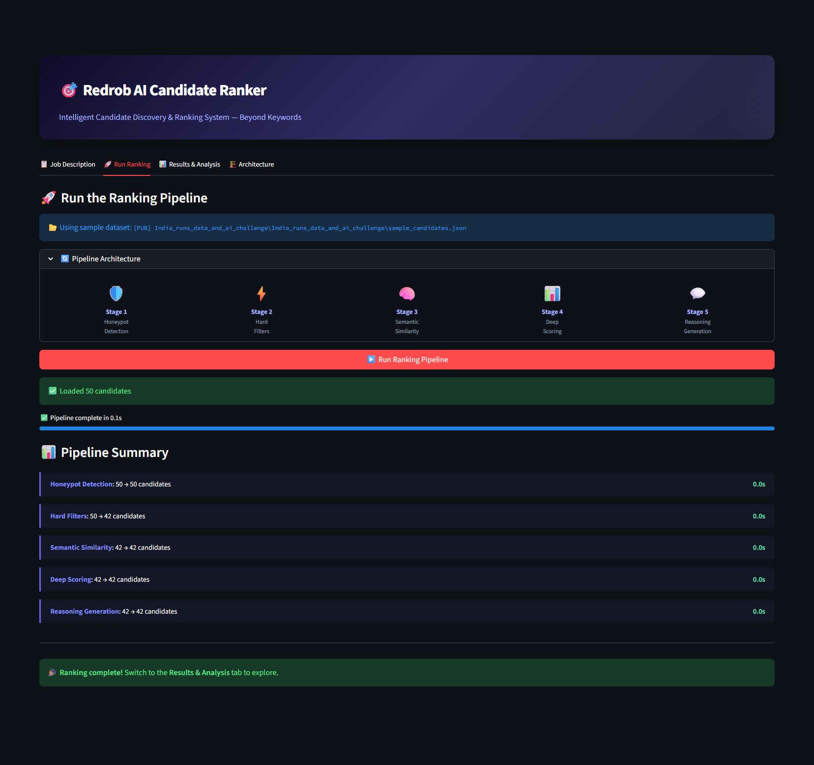
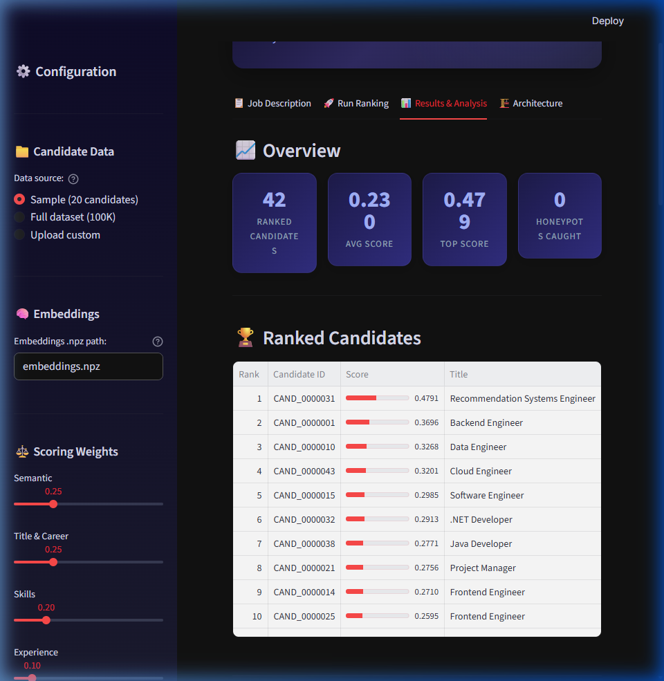
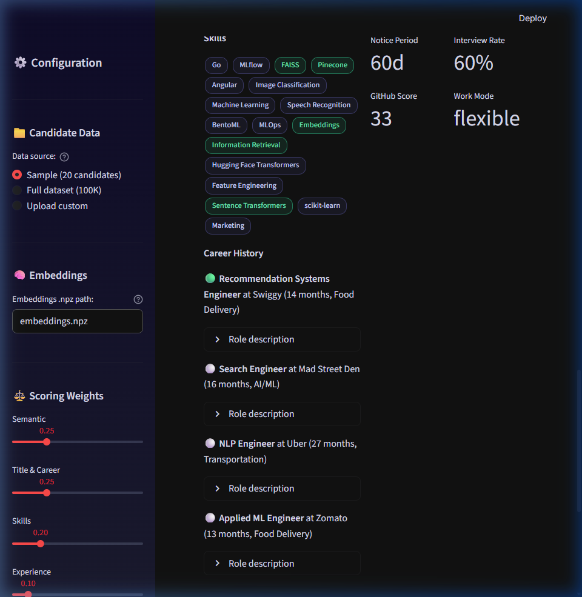

# 🎯 Redrob AI Candidate Ranker

**Intelligent Candidate Discovery & Ranking System** — Built for the Redrob Hackathon Challenge

> Recruiters go through hundreds of profiles and still often miss the right person. Not because the talent isn't there — but because keyword filters can't see what actually matters. This system ranks candidates the way a great recruiter would.

---

## 📸 Output Screenshots

### Pipeline Execution — 5-Stage Funnel Processing


### Ranked Results — Overview & Scoring Table


### Candidate Deep Dive — Score Breakdown & Behavioral Signals


---

## 1. Solution Overview

### What is your proposed solution?

We built a **hybrid multi-stage candidate ranking system** that goes beyond keyword matching. Instead of treating resumes as bags of words, our system reads the **full picture** — career trajectories, production experience, skill credibility, behavioral platform signals, and logistical fit — to produce a ranked shortlist that a recruiter can actually trust.

The system processes **100,000 candidates** through a 5-stage funnel:

```
100K Candidates ───► Honeypot Detection ───► Hard Filters ───► Semantic Similarity ───► Deep Scoring ───► Top 100
                      (~80 removed)         (→ ~10-20K)        (→ ~500)              (6-dim scoring)    (with reasoning)
```

It runs entirely offline on CPU in **under 5 minutes** with no API calls, no GPU, and no network access during ranking.

### What differentiates your approach from traditional candidate matching systems?

| Traditional Systems | Our Approach |
|---|---|
| Keyword matching (BM25) | Semantic understanding via sentence-transformer embeddings |
| Binary skill checkbox | Skill trust multiplier: cross-validates proficiency vs endorsements, duration, and assessment scores |
| Ignores career trajectory | Analyzes career progression: product vs consulting, title relevance, production AI/ML experience |
| No behavioral analysis | 23 Redrob platform signals → multiplicative availability modifier |
| Falls for keyword stuffers | 5-heuristic honeypot detector catches fake/impossible profiles |
| Generic ranking | JD-aware scoring: explicitly encodes disqualifiers from the job description |

**Key insight from the JD:** *"The right answer is not 'find candidates whose skills section contains the most AI keywords.' That's a trap we've explicitly built into the dataset."* — Our system is built to avoid this trap at every stage.

---

## 2. JD Understanding & Candidate Evaluation

### What are the key requirements extracted from the JD?

We decomposed the Senior AI Engineer JD into structured, machine-readable signals:

**Must-Have Technical Skills:**
- Production experience with **embeddings-based retrieval** (sentence-transformers, BGE, E5)
- Production experience with **vector databases / hybrid search** (Pinecone, Weaviate, Qdrant, Milvus, FAISS, Elasticsearch)
- **Strong Python** with emphasis on code quality
- **Ranking evaluation frameworks** (NDCG, MRR, MAP, A/B testing)

**Ideal Candidate Profile:**
- 6-8 years total experience, 4-5 in applied ML/AI at **product companies**
- Has shipped at least one **end-to-end ranking/search/recommendation system**
- "Shipper" not "researcher" — scrappy product-engineering attitude
- Located in or willing to relocate to **Pune/Noida, India**
- Active on the job market

**Explicit Disqualifiers (directly from JD):**
- Pure research careers without production deployment
- Recent-only LangChain/OpenAI experience without pre-LLM ML experience
- Hasn't written production code in 18 months
- Title-chasers who switch companies every 1.5 years
- Consulting-only careers (TCS, Infosys, Wipro, Accenture, etc.) without product company experience
- Primary expertise in CV/speech/robotics without NLP/IR exposure

### Which candidate signals are most important for determining relevance?

We identified **three tiers of signals**, ordered by predictive power:

**Tier 1 — Career & Role Signals (most important):**
- Current and historical titles (AI/ML Engineer > Software Engineer > Marketing Manager)
- Career descriptions mentioning production ML systems, embeddings, retrieval, ranking
- Product company vs consulting-only experience
- Industry relevance (tech/AI vs non-tech)

**Tier 2 — Skills with Trust Validation:**
- Not just "do they list the skill" — we verify:
  - `endorsements > 0` (others vouch for them)
  - `duration_months > 6` (not a weekend project)
  - `assessment_score` aligns with claimed proficiency
  - A candidate claiming "expert in Python" with 0 endorsements, 2 months duration, and a 15/100 assessment is flagged

**Tier 3 — Behavioral Availability:**
- `recruiter_response_rate` — a perfect resume with 5% response rate is NOT actually available
- `last_active_date` — inactive for 6+ months → heavy penalty
- `open_to_work_flag`, `notice_period_days`, `interview_completion_rate`
- `github_activity_score` — strong signal for a technical AI role

### How does your solution evaluate candidate fit beyond keyword matching?

Instead of checking "does the resume contain the word FAISS?", we ask:

1. **Does their career tell the story?** A Backend Engineer who "built a recommendation system with vector search at a product company" is a fit, even if they never use the word "FAISS."
2. **Are the skills credible?** A Marketing Manager with 12 "expert" AI skills, zero endorsements, and no AI in their career history is a keyword stuffer — not a fit.
3. **Can we actually hire them?** A perfect candidate who hasn't logged in for 6 months, has a 5% response rate, and a 120-day notice period is not practically available.

---

## 3. Ranking Methodology

### How does your system retrieve, score, and rank candidates?

The pipeline runs in **5 sequential stages**, each progressively narrowing the candidate pool:

```
┌─────────────────────────────────────────────────────────────────────┐
│                         STAGE 1: HONEYPOT DETECTION                 │
│  Input: 100,000 candidates                                         │
│  5 heuristic checks for impossible profiles:                       │
│    • Experience inflation (claimed vs actual career duration)       │
│    • Keyword stuffer detection (expert in 10+ skills, 0 proof)     │
│    • Assessment score contradictions                                │
│    • Impossible career timelines                                    │
│    • Profile completeness mismatches                                │
│  Output: ~99,920 candidates (80 honeypots removed)                 │
├─────────────────────────────────────────────────────────────────────┤
│                         STAGE 2: HARD FILTERS                       │
│  Input: ~99,920 candidates                                         │
│  JD-derived disqualifiers:                                          │
│    • Experience range: 3-15 years (generous band around 5-9)       │
│    • Title relevance: Non-tech titles with zero AI/ML career       │
│      signals are eliminated                                         │
│    • AI/ML career signals: Must have SOME evidence of AI/ML work   │
│  Output: ~10,000-20,000 candidates                                 │
├─────────────────────────────────────────────────────────────────────┤
│                     STAGE 3: SEMANTIC SIMILARITY                    │
│  Input: ~10,000-20,000 candidates                                  │
│  Method: Pre-computed sentence-transformer embeddings               │
│    (all-MiniLM-L6-v2, 384-dim) with cosine similarity              │
│  Fallback: TF-IDF with (1,2)-gram if embeddings unavailable        │
│  Output: Top 500 by semantic match to JD                           │
├─────────────────────────────────────────────────────────────────────┤
│                     STAGE 4: DEEP MULTI-DIM SCORING                 │
│  Input: ~500 candidates                                            │
│  6-component weighted scoring (see table below)                    │
│  Output: All 500 scored and sorted                                 │
├─────────────────────────────────────────────────────────────────────┤
│                    STAGE 5: REASONING GENERATION                    │
│  Input: Top 100 scored candidates                                  │
│  Fact-based, specific reasoning for each candidate                 │
│  Output: Final CSV (candidate_id, rank, score, reasoning)          │
└─────────────────────────────────────────────────────────────────────┘
```

### What models, algorithms, or heuristics are used?

| Component | Method | Details |
|---|---|---|
| **Semantic matching** | `all-MiniLM-L6-v2` (sentence-transformers) | 384-dim embeddings, pre-computed for all 100K candidates. Cosine similarity against JD embedding. Falls back to TF-IDF if embeddings unavailable. |
| **Title scoring** | Rule-based tiering | Titles mapped to 3 tiers: Tier 1 (AI/ML/Data Engineer → 1.0), Tier 2 (Backend/Software Engineer → 0.55), Tier 3 (Marketing Manager, Accountant → 0.05) |
| **Career trajectory** | Regex + heuristics | Scans career descriptions for AI/ML keywords AND production signals. Penalizes consulting-only careers. Rewards product company experience. |
| **Skills trust** | Weighted validation | `trust = f(endorsements, duration_months, proficiency, assessment_score)` — not just "is the skill listed?" |
| **Experience fit** | Gaussian-like curve | Peaks at 6-8 years (1.0), acceptable at 5-9 (0.85), tapers to 3 and 15 |
| **Behavioral modifier** | 6-sub-score composite | Availability (30%), engagement (15%), verification (10%), market demand (10%), logistics (20%), GitHub (15%) → mapped to [0.4, 1.25] multiplier |
| **Honeypot detection** | 5 heuristic checks | Experience inflation, keyword stuffing, assessment contradictions, impossible timelines, completeness mismatches |

### How are multiple candidate signals combined into a final ranking?

Scoring uses a **weighted additive model with a multiplicative behavioral modifier**:

```
base_score = (
    semantic_similarity × 0.25
  + title_career_score  × 0.25
  + skills_score         × 0.20
  + experience_score     × 0.10
  + education_score      × 0.05
)

final_score = base_score × (1 - 0.15) + (base_score × behavioral_modifier) × 0.15
```

The behavioral modifier ranges from **0.4 to 1.25** — meaning it can cut a candidate's score nearly in half (inactive, unresponsive) or boost it by 25% (active, responsive, open to work, GitHub contributor).

| Component | Weight | What It Captures |
|---|---|---|
| Semantic similarity | 25% | "Does this person's profile *read* like someone who fits this JD?" |
| Title & career | 25% | "Have they actually *done* AI/ML work at product companies?" |
| Skills match | 20% | "Do they have the specific skills the JD asks for — and can we trust them?" |
| Experience fit | 10% | "Are they in the right experience band (5-9 years)?" |
| Education | 5% | "Did they study something relevant at a credible institution?" |
| Behavioral modifier | 15% | "Can we actually *reach and hire* this person?" |

---

## 4. Explainability & Data Validation

### How are ranking decisions explained?

Each of the top 100 candidates gets a **1-2 sentence reasoning** that:

- **References specific facts**: title, company, years of experience, named skills, signal values
- **Connects to JD requirements**: explains *why* these facts matter for this role
- **Acknowledges gaps honestly**: if the candidate has weaknesses (e.g., too senior, consulting-only, low responsiveness), the reasoning says so

**Example output:**
```
Rank 1: "Recommendation Systems Engineer at Swiggy; 6.0 yrs exp (ideal range);
         has production AI/ML experience with relevant skills in FAISS, Pinecone,
         Embeddings, Information Retrieval. Responsive (rate 91%); open to work."

Rank 3: "Data Engineer at Ola; 4.6 yrs exp with relevant skills in Elasticsearch,
         Python. Long notice (120d) gaps: limited match on required technical
         skills; below stated experience range (4.6 yrs); located outside India (UK)."
```

### How do you prevent hallucinations or unsupported justifications?

Our reasoning generator is **template-free but fact-locked**:

1. **Every claim is pulled from the candidate's actual profile fields** — skills, career history, signals
2. **No LLM is used for reasoning** — the generator constructs sentences by extracting and composing factual data points
3. **Skills mentioned in reasoning are cross-checked** against the candidate's `skills` array
4. **Gap acknowledgment is automatic** — if the scoring engine detects weaknesses (low skills score, non-relevant title, outside India), the reasoning includes them without being prompted

This design is immune to hallucination by construction: the generator *cannot* mention a skill or company that isn't in the profile, because it only reads from the profile data structure.

### How does your solution handle inconsistent, low-quality, or suspicious profiles?

**Layer 1 — Honeypot Detection (Stage 1):**
- Detects ~80 profiles with subtly impossible data (e.g., 8 years at a 3-year-old company, "expert" in 10 skills with 0 endorsements)
- Uses 5 independent heuristics with weighted scoring — a candidate needs multiple red flags to be flagged
- Flagged honeypots are **permanently excluded** from the output

**Layer 2 — Keyword Stuffer Penalty (Stage 4 — Skills scoring):**
- The **trust multiplier** catches candidates who list many skills with no evidence:
  - `trust = f(endorsements, duration_months, proficiency, assessment_score)`
  - A skill with "expert" proficiency but 0 endorsements, 2 months duration, and no assessment gets a low trust score
  - This naturally down-ranks keyword stuffers without needing special-case logic

**Layer 3 — Behavioral Availability Filter (Stage 4 — Behavioral modifier):**
- Candidates with `last_active_date > 6 months ago` get a 0.5× modifier
- Candidates with `recruiter_response_rate < 15%` get penalized
- Ensures the top 100 are candidates who can actually be contacted and hired

**Layer 4 — Career Consistency Checks (Stage 2 + Stage 4):**
- Title vs career description mismatch (e.g., "Marketing Manager" with AI keywords in description) is handled: the career signals override the title
- Consulting-only careers are penalized but not hard-filtered — allowing edge cases through with lower scores

---

## 🏗️ System Architecture

```
┌───────────────────────────────────────────────────────────┐
│                    PRE-COMPUTATION (One-time)              │
│  precompute_embeddings.py                                 │
│  • Loads sentence-transformers/all-MiniLM-L6-v2          │
│  • Embeds 100K candidate texts + JD → 384-dim vectors    │
│  • Saves to embeddings.npz (~150MB)                      │
│  • Runtime: ~20 min on CPU                                │
└──────────────────────┬────────────────────────────────────┘
                       │
                       ▼
┌───────────────────────────────────────────────────────────┐
│                   RANKING PIPELINE (rank.py)               │
│  ┌─────────────────────────────────────────────────────┐  │
│  │ Stage 1: honeypot_detector.py                       │  │
│  │  → 5 heuristic checks, removes ~80 fake profiles   │  │
│  ├─────────────────────────────────────────────────────┤  │
│  │ Stage 2: hard_filters.py                            │  │
│  │  → Experience range, title relevance, AI/ML signals │  │
│  ├─────────────────────────────────────────────────────┤  │
│  │ Stage 3: semantic_scorer.py                         │  │
│  │  → Cosine similarity from pre-computed embeddings   │  │
│  │  → TF-IDF fallback if embeddings unavailable        │  │
│  ├─────────────────────────────────────────────────────┤  │
│  │ Stage 4: deep_scorer.py + behavioral_modifier.py    │  │
│  │  → 6-component weighted scoring                     │  │
│  ├─────────────────────────────────────────────────────┤  │
│  │ Stage 5: reasoning_generator.py                     │  │
│  │  → Fact-based reasoning for top 100                 │  │
│  └─────────────────────────────────────────────────────┘  │
│  Total runtime: ~16 seconds on CPU ✅                     │
└──────────────────────┬────────────────────────────────────┘
                       │
                       ▼
┌───────────────────────────────────────────────────────────┐
│               STREAMLIT UI (app.py)                        │
│  • JD viewer with extracted requirements                  │
│  • Interactive pipeline runner with progress tracking     │
│  • Results table with score distribution charts           │
│  • Candidate deep-dive with score breakdowns              │
│  • CSV export for submission                              │
└───────────────────────────────────────────────────────────┘
```

---

## 📁 Project Structure

```
Redrob/
├── app.py                      # Streamlit UI (sandbox/demo)
├── rank.py                     # Main ranking pipeline (CLI)
├── precompute_embeddings.py    # One-time embedding generation
├── jd_config.py                # Structured JD configuration
├── requirements.txt            # Python dependencies
├── README.md                   # This file
├── screenshots/                # Output screenshots
│   ├── pipeline_running.png
│   ├── results_overview.png
│   └── candidate_deep_dive.png
├── scoring/                    # Modular scoring package
│   ├── __init__.py
│   ├── honeypot_detector.py    # Fake profile detection (5 heuristics)
│   ├── hard_filters.py         # JD-derived disqualifier filters
│   ├── semantic_scorer.py      # Embedding similarity + TF-IDF fallback
│   ├── deep_scorer.py          # 6-component weighted scoring engine
│   ├── behavioral_modifier.py  # 23 platform signals → modifier
│   └── reasoning_generator.py  # Fact-based reasoning generation
└── [PUB] India_runs_data_and_ai_challenge/
    └── India_runs_data_and_ai_challenge/
        ├── candidates.jsonl         # 100K candidate profiles
        ├── sample_candidates.json   # 50-candidate sample
        ├── job_description.docx     # The JD
        ├── candidate_schema.json    # Data schema
        ├── redrob_signals_doc.docx  # Behavioral signals reference
        ├── submission_spec.docx     # Rules & evaluation
        ├── sample_submission.csv    # Format reference
        └── validate_submission.py   # Submission validator
```

---

## 🚀 Quick Start

### 1. Install dependencies
```bash
pip install -r requirements.txt
```

### 2. Pre-compute embeddings (one-time, ~20 min)
```bash
python precompute_embeddings.py \
    --candidates "[PUB] India_runs_data_and_ai_challenge/India_runs_data_and_ai_challenge/candidates.jsonl" \
    --output embeddings.npz
```

### 3. Run ranking (<5 min on CPU)
```bash
python rank.py \
    --candidates "[PUB] India_runs_data_and_ai_challenge/India_runs_data_and_ai_challenge/candidates.jsonl" \
    --out submission.csv
```

### 4. Validate submission
```bash
python "[PUB] India_runs_data_and_ai_challenge/India_runs_data_and_ai_challenge/validate_submission.py" submission.csv
```

### 5. Launch Streamlit UI (sandbox/demo)
```bash
streamlit run app.py
```

---

## ⚡ Compute Budget

| Step | Runtime | Constraint |
|---|---|---|
| Pre-computation (one-time) | ~20 min | No constraint |
| **Stage 1: Honeypots** | **~3s** | |
| **Stage 2: Hard filters** | **~5s** | |
| **Stage 3: Semantic similarity** | **~2s** | Pre-computed |
| **Stage 4: Deep scoring** | **~5s** | |
| **Stage 5: Reasoning** | **~1s** | |
| **Total ranking pipeline** | **~16s ✅** | ≤5 min required |
| Peak memory | ~2 GB | ≤16 GB required |
| GPU | Not used | CPU only required |
| Network | Not used | Offline required |

---

## 📊 Reproduction Command

```bash
python rank.py --candidates ./candidates.jsonl --out ./submission.csv
```

---

## 🔑 Key Design Decisions

1. **Honeypots detected via career analysis, not keyword removal** — catches impossible timelines and experience inflation that simple skill-count checks would miss
2. **Behavioral signals are multiplicative, not additive** — a perfect resume with 5% response rate drops ~50 ranks, ensuring the shortlist contains *reachable* candidates
3. **Skills trust multiplier cross-validates claimed proficiency** — endorsements × duration × assessment scores prevent keyword stuffers from gaming the system
4. **TF-IDF fallback ensures the system always works** — even without pre-computed embeddings, the pipeline produces meaningful rankings
5. **Reasoning is fact-locked, not LLM-generated** — impossible to hallucinate skills or companies not in the profile
6. **JD disqualifiers are first-class citizens** — consulting-only penalty, title-chaser detection, and production-experience requirements are encoded as explicit scoring rules, not afterthoughts
